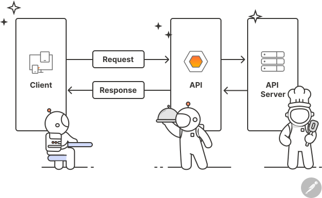

# MVC ⚔ API

İstənilən layihəni hazırlamağa başlamadan öncə proqramçıların ağlına gələn ilk sual:
**Layihəni MVC edək yoxsa API ilə front-endi ayıraq?** olur.<br>
Bu sual çox vaxt layihə menecerlərini narahat etsə də, bəzən full-stack developerlərin də başını ağrıdan sual olur. Çünki hər bir strukturun özlüyündə müsbət və mənfi tərəfləri var, eləcə də bəzən bu layihənin də qiymətinə təsir edə bilir(cuzi şəkildə). Bu günki yazımızda hər iki yanaşmanın müsbət və mənfi cəhətlərindən, nə zaman istifadəli edilməlidirlər kimi mövzulardan danışacaq və yuxarıdakı suala bacara bildiyimiz qədər cavab verməyə çalışacağıq. Elə isə gəlin ilk sualımızı verək. Nədir bu MVC?

## MVC


MVC 1970-ci illərdə [Trygve Reenskaug](https://en.wikipedia.org/wiki/Trygve_Reenskaug) tərəfindən yaradılıb və Model-View-Controller sözlərinin baş hərflərindən ibarətdir. Bəzən sadəcə veb dünyasında olduğu düşünülsə də özlüyündə bir dizayn pattern-dir, bu o deməkdir ki, biz MVC-ni konsol layihədə belə tətbiq edə bilərik. Aşağıda hər parçanın kiçik də olsa izahını tapa bilərsiniz:

### View

Son məhsuldur. İstifadəçinin görəcəyi html, css, js kodları bu bölmədə yazılır və istifadəçiyə response olaraq göndərilir. C#(ASP.Net MVC), Java(Spring Boot), Php(Laravel) kimi dillərin frameworkləri(bir növ kitabxanaları deyə bilərik) özlərində Viewları fərqli fayl tipləri təklif edirlər. Məsələn C#-da bu fayl .cshtml, Java-da .jsp, Php-də isə .blade.php-dir. Tiplər fərqli olmağına baxmayaraq demək olar hər birində rahatlıqla html, css, js kodları yaza bilərik. Əsas fərq isə dinamikləşdirmə məsələsindədir. Məsələn deyək ki, sistemimizdə 50 məhsul var və bunların hər birini əlimizlə aşağıdakı kimi yazmaqdansa:

```html
<ul>
  <li>
    <h3>Məhsul 1</h3>
    
  </li>
  <li>
    <h3>Məhsul 2</h3>
    
  </li>
  <li>
    <h3>Məhsul 3</h3>
    
  </li>
  <li>
    <h3>Məhsul 3</h3>
    
  </li>
  <!-- Məhsulların ardı ... -->
</ul>
```

Biz bu fərqli fayl tiplərində, sadə proqramlaşdırma məntiqi işlədərək dinamikləşdirmə əldə edə bilərik:

```cshtml
@{
var mehsullar = new List<Mehsul>()
{
	new ()
	{
		Name = "Məhsul 1",
		ImageUrl = "mehsul1.png"
	},
	new ()
	{
		Name = "Məhsul 2",
		ImageUrl = "mehsul2.png"
	},
	new ()
	{
		Name = "Məhsul 3",
		ImageUrl = "mehsul3.png"
	}
	// mehsullarin ardi
};

}

<ul>
	@foreach(var mehsul in mehsullar)
	{
		<li>
			<h3>Məhsul 1</h3>
			
		</li>
	}
</ul>
```

Bəzi front-endçi dostlarımız bunu React, Angular kimi texnologiyalar ilə də edə bilirik deyə bilərlər. Haqlıdırlar, elə bu məqalə də həmin texnologiyaların fərqləri üçündür. Qısaca desək, View istifadəçiyə çatan bölmədir. Biz veb aplikasiyaları yazarkən View-ları `Views` adlı qovluqda saxlamağı tərcih edirik. Elə isə keçək modelə.

### Model

Modellər bizim sistemlərdə çox vacib yer tuturlar, bəzən onların Entity kimi adlandırıldığını da görə bilərsiniz. Databazada olan cədvəllərimizin kod ilə **model**lənmiş versiyasıdır. Məsələn, databazamızda şagirdlər adlı cədvəlimiz ola bilər və biz sistemimizdə bunu şagird modeli kimi saxlaya(və ya başqa sözlə modelləyə bilərik). Yuxarıdakı nümunədə isə Mehsul adlı bir tipin istifadə edildiyini gördük elə həmin nümunədə Mehsul bizim modelimizdir. Çox vaxtı Modelləri `Models` adlı qovluqda saxlamaq tərcih edilir. Sual yarana bilər ki, bəs bütün bu model-lər və view-lar arasında əlaqəni kim bərpa edir, yəni məsələn lazımi məlumatlar databazadan viewlara necə gəlir və ya necə istifadəçiyə göndərilir? Bütün bu prosessləri kim/kimlər **idarə** edir? Bunun cavabı isə Controller-dədir.

### Controller

Controller-i ortadakı körpü kimi fikirləşmək olar. Bu dostumuz, lazım olan məlumatları View-lara daşıyır və ya lazım olan View-u istifadəçiyə göndərir. İşi sadə görünsə də ən ağır iş həmişə controller-in üstündə olur. Lakin controller-dən bu yükü azaltmaq üçün Action adlı bir termin var ki, işləri daha da atomikləşdirir. Misal olaraq aşağıdakı controller nümunəsinə baxa bilərik:

```c#

public class AccountController : Controller
{

// controllerin evveli
[HttpPost]
public async Task<IActionResult> Register(RegisterVm registerVm)
{
	if (!ModelState.IsValid)
		return View(registerVm);

	AppUser usr = new()
	{
		Email = registerVm.Email,
		UserName = registerVm.UserName
	};

    var res = await _userManager.CreateAsync(usr, registerVm.Password);

	await _userManager.AddToRoleAsync(usr, "Admin");

	return RedirectToAction("Login", "Account");
}
// controllerin ardi

}

```

Istifadəçini qeydiyyatdan keçirmək üçün olan sadə bir Controller Action-dur. Gördüyünüz kimi bəzən View ilə danışır bəzən isə Model-lərlə.

### MVC-nin müsbət və mənfi cəhətləri


#### Müsbət tərəfləri

- Yuxarıda görüldüyü kimi bu şəkildə 3 parçadan ibarət olması hərkəsin sadəcə öz işindən məsuliyyət daşımasının qarantiyasını verir
- Öyrənilməsi asandır
- Development prosesi sürətli olur
- İllərdir veb dünyasında dominant olduğu üçün iş tapmanı asanlaşdırır

#### Mənfi tərəfləri

- Bəzən back-end developerin front-end kodu da yazmağına səbəb olur
- Həm front həm back eyni proyektdə olduğu üçün, başqa bir sözlə monolitik struktur səbəbi ilə komanda işini də yavaşladır
- Proyekt böyüdükçə fərqli arxitektura həlləri tətbiq edilsə belə yenə idarə etməsi çətinləşir
- Test edilməsi çətin olur
  Mənfi cəhətlərin ilk bəndindəki bəzən sözü onu bildirir ki, çox vaxtı front-end developerlər ayrıca UI/UX dizaynerlərlə birlikdə saytın statik versiyasını hazırlayırlar, daha sonra biz onu MVC patter-nə keçirəndə dinamikləşdirməli oluruq, ki bu bəzən back-end-də struktor dəyişikliklərinə səbəb olur. Bu da özlüyündə development prosesini yavaşladır(Əgər ayrı şəkildə işləməyə qərar verilibsə). MVC haqqında çox danışdıq, indi isə növbəti sualı verək. Hər yerdə eşitdiyimiz API, nədir axı?

## API


API sözü ilk dəfə 1940-cı illərdə ortaya çıxsa da məhşurlaşması MVC kimi 1970-ci illərə təsir edir. Adını Application Programming Interface sözlərinin baş hərflərindən götürüb. Təkcə veb dünyasında deyil proqramlaşdırmanın demək olar istənilən hissəsinə təsir edən məhvumdur. Veb dünyasında isə API-lər istifadə edilərək front-end və back-end proqramçılar ayrıla bilir. Beləcə hər iki tərəf bir-birilərindən "asılı olmadan" proyekti yaza bilirlər. C# dili ilə də Web API-lər yazmaq mümkündür. Hətta maraqlı tərəfi odur ki, MVC məntiqinə çox oxşar olduğu üçün MVC proqramçıları rahatlıqla WEB API-lər yaza bilirlər. API-lər özlərində isə 2 yerə bölünürlər: SOAP və RESTful.

### SOAP


Açılışı Simple Object Access Protocol-dur. RESTful API-lərdən öncə sahəni dominant edən API növlərindən olubdur. Ki, hələ də mobil aplikasiya üçün yazılan API-ların bir çoxunda istifadə edilir. Lakin, zaman keçdikcə RESTful API-lər SOAP-ları əvəz edirlər(mobildə belə). Bunun səbəbi isə SOAP-ın məlumat transferi üçün XML(extensible markup language) istifadə etməsidir, hansı ki özlüyündə çox ağırdır. Bu da bizim HTTP request və responsların həcmini böyüdür.

### RESTful


Açılışı Representational State Transfer-dən gəlir. SOAP-a görə tərcih edilməsinin əsas səbəbi özündə JSON(JavaScript Object Notation) formatı işlətməyidir. Adında JavaScript sözünün olmasına baxmayaraq demək olar bütün proqramlaşdırma dilləri tərəfindən tanınan bir formatdır. Hətta belə bir bənzətmə belə verə bilərik ki, proqramlaşdırma dünyasının ingilis dilidir. JSON formatını işlətməklə HTTP requestlər və responslarımızın daha yüngül olmasına nail oluruq. Əgər JSON-dan da yüngül format axtarırsınızsa ProtoBuff-lara baxa bilərsiniz(bu ayrı yazımızın mövzusudur🤠)

> İndi isə keçək pis və yaxşı tərəflərinə

### API-nin müsbət və mənfi cəhətləri

#### Müsbət tərəfləri

- Front-end və back-end developerlərin ayrılması
- Testlərin rahatlaşması
- Proyektin böyüməyə açıq olması, əgər doğru dizayn patternləri tətbiq edilibsə(Onion arch, N-tier arch,CQRS, Mediator kimi)
- SOAP və ya RESTful şəklində yazılan HTTP response-ların yüngülləşməsi(MVC-də HTML, CSS, JS response olaraq verilirdi)

#### Mənfi tərəfləri

- Proqramçıların ayrılması development vaxtını artıra bilir
- Hər nə qədər back-end developerlər front-end developerlərdən asılı olmadıqları kimi görünsə də əslində necə response-lar verilməli olduğu, hansı endpointlərin yazılmalı olduğunu gözləməli olurlar. Yaxşı layihə meneceri bu problemi həll edir
- MVC layihə üçün bir server bəs elədiyi təqdirdə(əgər databaza və statik faylların saxlanılması ayrılırsa onda server sayı arta bilir), API ilə ayrılan front və back end-lər minimum iki ayrı serverdə yerləşdirilməli olur
- Hər tərəfli düşünülməli olduğu üçün quraşdırılması vaxt və maddiyyat tələb edir

Gördüyünüz kimi hər nə qədər, API-nin müsbət tərəfləri cəlbedici görünsə də, mənfi cəhətləri də nəzərə alınmalıdır. O zaman ilk sualımıza cavab verək?

## Layihəni MVC edək yoxsa API ilə front-endi ayıraq?

Bütün müsbət və mənfi cəhətləri analiz edəndə belə bir nəticəyə varırıq ki, hər yanaşma bizə fərqli situasiyalarda dəstək ola bilər.

- Əgər bir startup mühitində çalışırıqsa və büdcə limitlidirsə və ya ümumiyyətlə yoxdursa o zaman **MVC**-nin seçilməyi daha məqsədəuyğundur, belə ki həm sürətli development imkanı verir həm də komandanızda full-stack developer kimi yetişən biri varsa əlavə front-end developerə ehtiyac qalmır.
- Əgər layihənin müəyyən bir büdcəsi varsa və büdcə ilə yanaşı proyekt üçün yetərli vaxt təyin edilibsə o zaman **API** yanaşmasını seçmək daha yaxşı olar. Ki, gələcəkdə həmin veb aplikasiyanın mobil versiyasıda planlanırsa o zaman API əla seçimdir.
  Sadəcə bu kiçik analizlər belə göstərir ki, "**MVC** öldü" və ya "**API** hər şeyi məhv edəcək" kimi şaiyələr elə şaiyədirlər. Ona görə bir veb proqramçı kimi hər iki yanaşmanı da bilmək istənilən layihədə işləmək imkanı gətirir. Əgər siz də, həm MVC həm də API-ni keyfiyyətli şəkildə öyrənmək istəyirsinizsə full-stack təlimlərimizə qoşula bilərsiniz🤠
